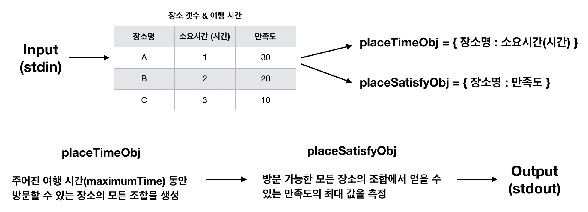

# 구현 외 문제



## 1. 만약에 특정한 장소를 무조건 방문해야 한다고 하면 알고리즘이 어떻게 변경될까요?

- 방문할 수 있는 장소의 모든 조합(`placeListJSON`)을 생성할 때, 무조건 방문해야 하는 장소(주어진 예시에서는 '오사카성')를 각 조합(`inner`)에 추가하고, 무조건 방문해야 하는 장소의 소요시간(주어진 예시의 '오사카성'의 경우에는 2시간)을 `currentTime`에 처음부터 더해둔 상태에서 장소의 조합을 만들어야 한다.

- 다만 모든 장소의 조합을 생성할 때, 무조건 방문해야 하는 장소를 Loop에서 검토해야할 필요는 없기 때문에 그 장소들은 `placeTimeObj` 객체를 생성할 때 제외시키는 것이 보다 효율적인 알고리즘이 될 것이다.

- `placeTimeObj` 객체를 새롭게 만들었다고 가정한다면, 현재 작성한 알고리즘의 _getPlaceOption_ 함수에서 초기의 개별 방문 가능한 장소의 조합 배열(`inner`)과 현재 스케쥴 소요 시간(`currentTime`)을 설정하는 부분(6~10번째 줄)의 알고리즘은 아래와 같이 변경될 것이다.

```
// 예시와 같이 오사카성을 무조건 방문해야 할 경우
for (let i = 0; i < placeName.length - 1; i++) {
  currentPlace = placeName[i];

  let inner = ['오사카성'];
  let currentTime = 2

  ...
}
```

<br/>

## 2. 장소 간 이동 시간도 고려해야 한다면, 알고리즘이 어떻게 변경될까요?

- 장소 간 이동 시간을 고려해야 할 경우, 방문 가능한 모든 장소의 조합에서 장소간 순서가 반영되어야 한다. 장소간 이동 시간은 주어진 문제에서의 가장 큰 제약조건 중 하나인 **여행 시간**에 영향을 미치는 것이기 때문에 방문 가능한 모든 장소의 조합을 생성할 때 추가적인 연산이 필요하다.

- 처음 목적지를 정한 이후, 새로운 for Loop이 시작되면 `currentTime`에 `이동시간(movingTime)`의 값을 찾아서 다음 목적지의 `소요시간`과 함께 더하여 여행 시간과 현재 일정의 소요 시간을 비교하여 모든 장소의 조합을 생성해야 한다.

- 장소 간 이동 시간에 대한 정보가 어떠한 구조로 객체화 될 지는 알 수 없지만, 만약에 Object안에 Object로 있다고 가정한다면, 현재 작성한 알고리즘의 _getPlaceOption_ 함수에서 `currentTime`을 더하는(22~26번째 줄) 알고리즘은 아래와 같이 변경될 것이다.

```
for (let j = 0; j < placeName.length; j++) {
  if (i !== j) {
    newPlace = placeName[j];

    movingTime = travelTimeObj[currentPlace][newPlace];
    currentTime += (placeTimeObj[newPlace] + movingTime)

    ....
  }
}
```

<br/>

## 3. 만약에 방문하는 순서가 만족도에 영향을 끼친다면, 알고리즘이 어떻게 변경될까요?

- 방문하는 순서에 따라 만족도가 달라질 경우, 현재의 알고리즘과 달리 방문 가능한 모든 장소의 조합에서 순서를 반영한 장소의 조합을 만들어야 한다.

- 기존의 알고리즘은 아래와 같이 장소 간 순서를 반영하지 않았지만,

```
for (let i = 0; i < placeName.length - 1; i++) {
  for (let j = i + 1; j < placeName.length; j++)
} {
  .....
}
```

- 장소간 방문 순서를 만족도에 반영하기 위해서는 아래와 같이 변경하여 장소 간 순서를 반영한 장소의 조합을 생성해야 한다.

```
for (let i = 0; i < placeName.length - 1; i++) {
  for (let j = 0; j < placeName.length; j++)
} {
  .....
}
```

- 이후, 장소의 방문 순서에 따라 서로 다른 만족도를 얻어내기 위해서는 현재 `placeSatisfyObj` 객체가 단순히 `장소명: 만족도`의 key-value 값을 갖는 구조에서 `장소명: [처음 방문할 때의 만족도(index = 0), 두번째 방문할 떄의 만족도(index=1), ..., 마지막 방문할 때의 만족도(index=길이-1) ]`의 구조로 바꿔서 변수에 값을 할당해야 한다.

- 최종적으로 만족도를 계산할 시에는 placeSatisfyObj의 key값에 해당하는 장소명으로 만족도 Array를 찾아서, 해당 장소가 현재 방문 가능한 장소 조합에서의 index 값으로 최종적인 만족도를 얻을 수 있고 이를 더하여 만족도의 최대 값을 측정할 수 있다.

```
currentResult += obj[placeInfo[j]];
```

- 현재 알고리즘에서는 위와 같이 단순한 Object의 Value 값을 찾는 방식으로 만족도를 계산하지만, 순서를 반영할 경우 아래와 같은 방식으로 만족도를 계산해야 한다.

```
// 오사카성(placeInfo[j])을 첫번째(index=0)로 방문하는 경우,
currentResult += obj[placeInfo[j]][0]

// 오사카성(placeInfo[j])을 마지막(index=장소의 갯수 - 1)으로 방문하는 경우
currentResult += obj[placeInfo[j]][placeOption - 1]
```
